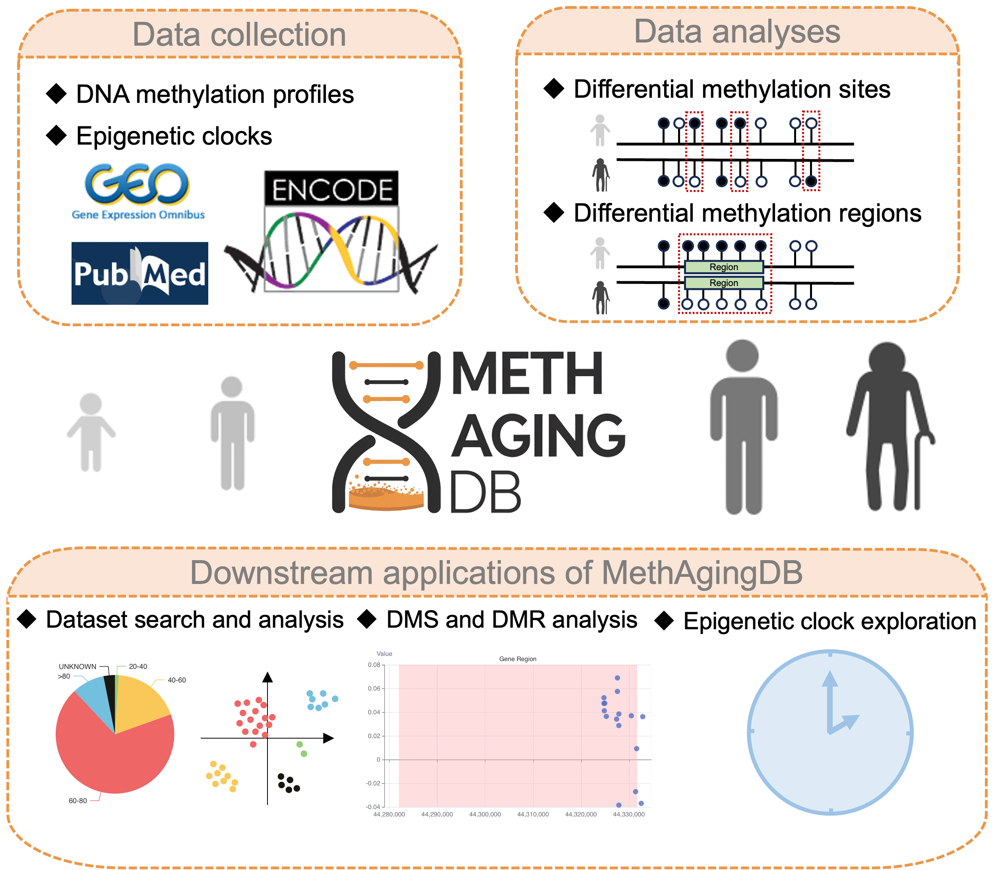

# **MethAgingDB: a comprehensive DNA methylation database for aging biology**

## Web interface

https://methagingdb.biox-nku.cn/

## Script description

| Script      | Description                                                  |
| ----------- | ------------------------------------------------------------ |
| getDMS.R    | Get differentially methylation sites (DMSs) between age groups. |
| getDMR.R    | Get differentially methylation regions (DMRs) between age groups. |
| run_tSNE.py | Get tSNE scatter plots of each dataset.                      |
